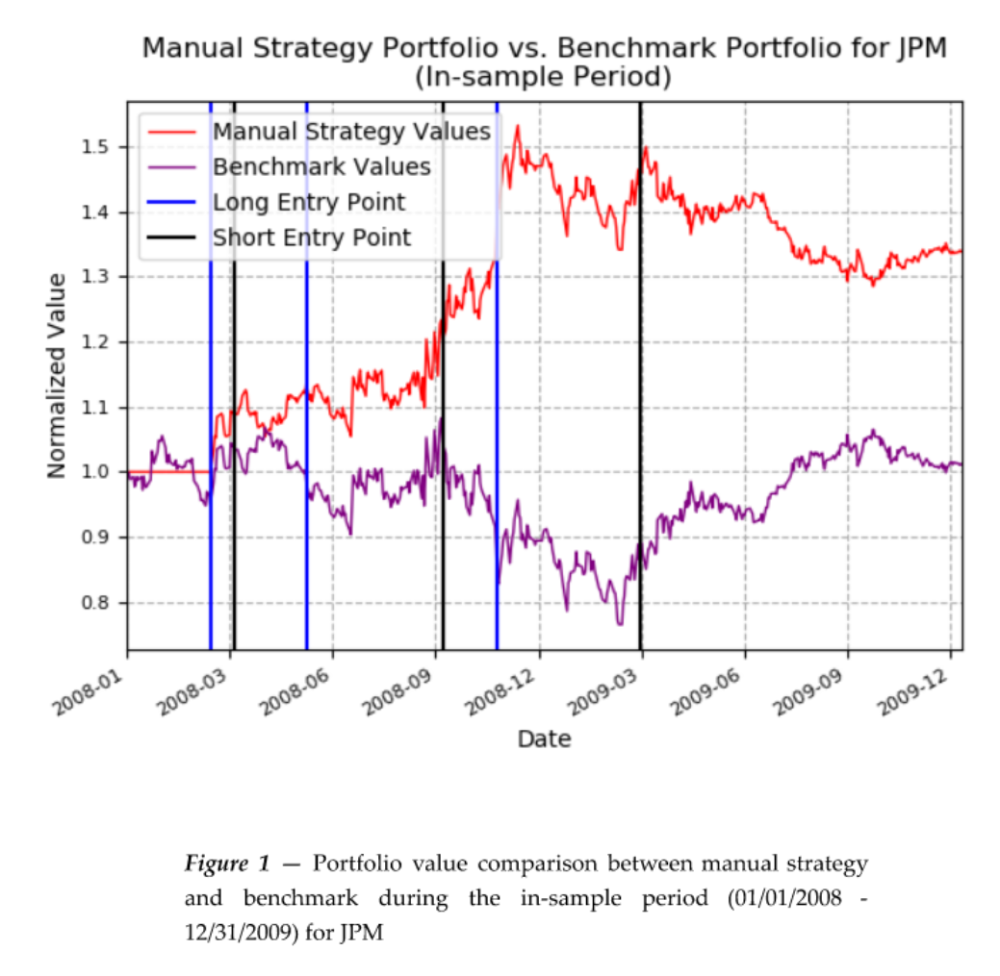
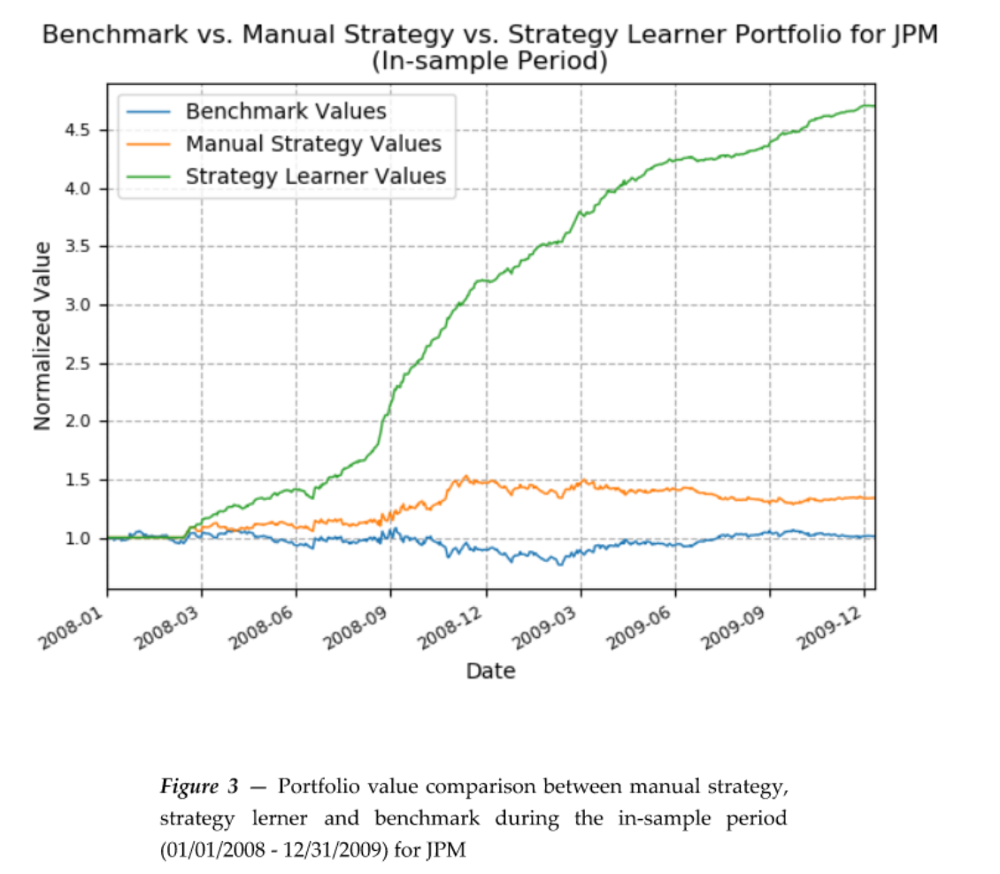
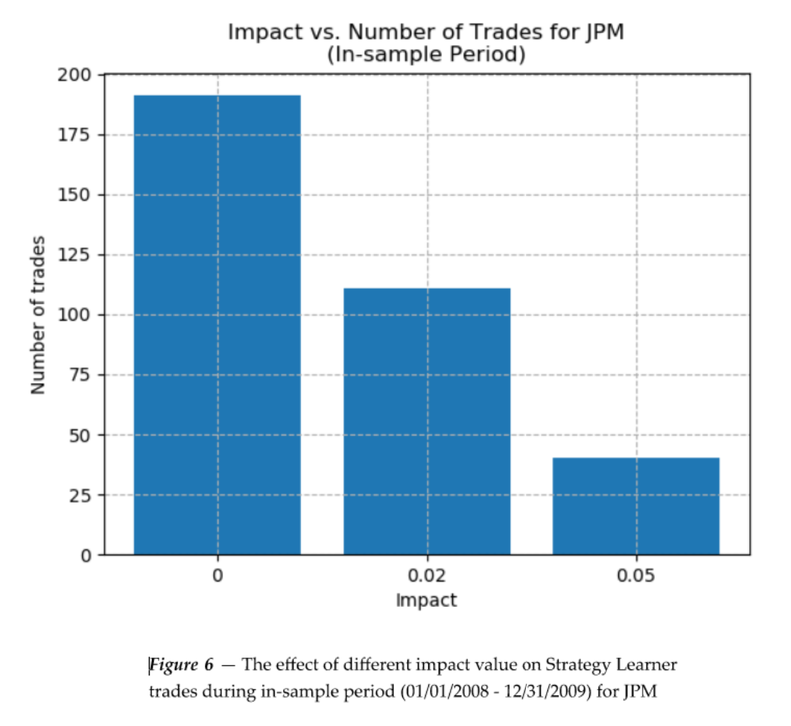

# Strategy Evaluation
The main purpose of this assignment is to develop a
manual strategy and a strategy learner using artificial intelligence
for trading rules. Several experiments are conducted to compare
the performance between the benchmark, manual strategy and
strategy learner portfolios.

# 1 INTRODUCTION
In this project, we trade only the symbol JPM. Two strategies were implemented:
manual and strategy learner. Qlearner was used for strategy learner. 3 indicators
were used to set the trading rules for both strategies: price/SMA ratio, RSI and
momentum, which are selected from the previous project 6.

The benchmark will be the performance of a portfolio starting with $100,000
cash, investing in 1000 shares of the symbol in use on the first trading day, and
holding that position. Include transaction costs.

After conducting the experiments, it was discovered that the performance of the
strategy learner is the best, followed by manual strategy and benchmark. The
detailed experiment results and conclusions are discussed below.

# 2 INDICATOR OVERVIEW
Three indicators were used to set the trading rules for both strategies: price/SMA ratio, RSI and momentum

## 2.1 Price/SMA Ratio
The price/SMA ratio is calculated from the normalized JPM price divided by the
normalized SMA value. The lookback period is 50 days for both manual strategy and strategy learner.
## 2.2 Relative Strength Index (RSI)
The lookback period is 14 days for both manual strategy and strategy learner.
## 2.3 Momentum
The lookback period is 10 days for both manual strategy and strategy learner.
# 3 MANUAL STRATEGY
The trading rules for manual strategy are set up as follows:
Long entry point (buy signal) - when Price/SMA value < 0.9 and RSI value < 30.
Or when RSI value < 30 and momentum value > 0. Or when Price/SMA value <
0.9 and momentum value > 0.

Short entry point (sell signal) - when Price/SMA value > 1.1 and RSI value > 70. Or when RSI value > 70 and momentum value < 0. Or when Price/SMA value >
1.1 and momentum value < 0.

The reasons for seing up the trading rules above are that when the price/SMA
ratio is less than 0.9 or 10% less than its average price, it usually indicates thestock is oversold and intends to bounce back to its average price. When price/SMA ratio is more than 1.1, it shows an overbought signal.

When the RSI is less than 30, it considers the stock is oversold while more than 70considers overbought, which was discussed in the previous project 6.

When the momentum value is crossing above the 0 and larger than 0, it usually
indicates the stock has lots of buy pressure and the price tends to go up higher. While the momentum value is less than 0, the sell pressure is much larger.

So the combination of these 3 indicators should be able to provide a reasonable long or short entry point. As shown in Figure 1 and Figure 2, the manual strategy outperformed the benchmark for both the in sample and out of sample periods. Also as shown in Table 1 and Table 2, the performance metrics of the manual strategy are all beer than the benchmark’s. This indicates that our manual strategy is effective.

# 4 STRATEGY LEARNER
Qlearner was used for strategy learner implementation.
## 4.1 Steps took to frame the trading problem
The strategy learner was implemented using the Qlearner that was developed in
project 7. The indicators define most of the “state” for the learner. Details steps are referenced from the course lecture and project 8 wiki, which are described below:

For the policy learning part:
- Select several technical features, and compute their values for the
training data
- Discretize the values of the features
- Instantiate a Q-learner
- For each day in the training data:
  - Compute the current state (including holding)
  - Compute the reward for the last action
  - Query the learner with the current state and reward
to get an action
  - Implement the action the learner returned (LONG, CASH, SHORT), and update portfolio value
- Repeat the above loop multiple times until cumulative return stops
improving.

For the policy testing part:
- For each day in the testing data:
  - Compute the current state
  - Query the learner with the current state to get an action
  - Implement the action the learner returned (LONG, CASH, SHORT), and update portfolio value
  - DO NOT UPDATE Q — learning must be turned off in this phase
- Return the resulting trades in a data frame

## 4.2 Q-learner hyperparameters
The same Qlearner hyperparameters from project 7 are used for this project.

Alpha = 0.2, the learning rate used in the update rule. Should range between 0
and 1 with 0.2 as a typical value.

Gamma = 0.9, the discount rate used in the update rule. Should range between 0
and 1 with 0.9 as a typical value. 

Rar = 0.5, random action rate: the probability of selecting a random action at each step. Should range between 0 and 1 with 0.5 as a typical value.

Radr = 0.99, random action decay rate, after each update, rar = rar * radr. Should range between 0 and 1 with 0.99 as a typical value. 

Dyna was not implemented for this Qleaner.
## 4.3 Discretization
Discretization is a process by which we convert a real number into an integer
across a limited scale. We use 0 to 9 scale of integers for this project. Number of buckets is 10.

Next, we determine the size of our buckets, which is simply the total number of
data elements divided by the number of buckets.

Finally, we sort the data and determine the threshold for each bucket based on
the step size.

# 5 EXPERIMENT 1
The experiment 1 is to compare the value of the manual strategy, strategy learner and benchmark portfolio (normalized to 1 at start) for stock symbol JPM during both in sample and out of sample periods.

As shown in Figure 3 and Figure 4 below, the performance of the strategy learner significantly outperforms the manual and benchmark strategy during the
in-sample period. This makes sense as we trained Qlearner using the in-sample
data so naturally the outcome should be excellent. The out-of-sample
performance of the strategy learner is still beer than manual and benchmark but
not as good as the in-sample period. This result aligns with our expectation
because the learner during the out-of-sample period is supposed to perform
worse since it’s using the testing data.

# 6 EXPERIMENT 2
The experiment 2 is to analyze how changing the value of impact should affect
in-sample trading behavior and results (provide at least two metrics, assessing a minimum of 3 different measurements for each metric).

Two metrics were provided: strategy learner portfolio and number of trades.

3 Different measurements: impact = 0, impact = 0.02 and impact = 0.05

As shown in Figure 5 and Figure 6 below, the larger the impact is , the lower the portfolio and trading frequency are. This is in line with our expectation since the higher transaction cost will affect the reward value of the Q-Learner. The reduced reward will make the learner “hesitate” to trade or make the next action, thus lose the opportunity to maximize the profit.

